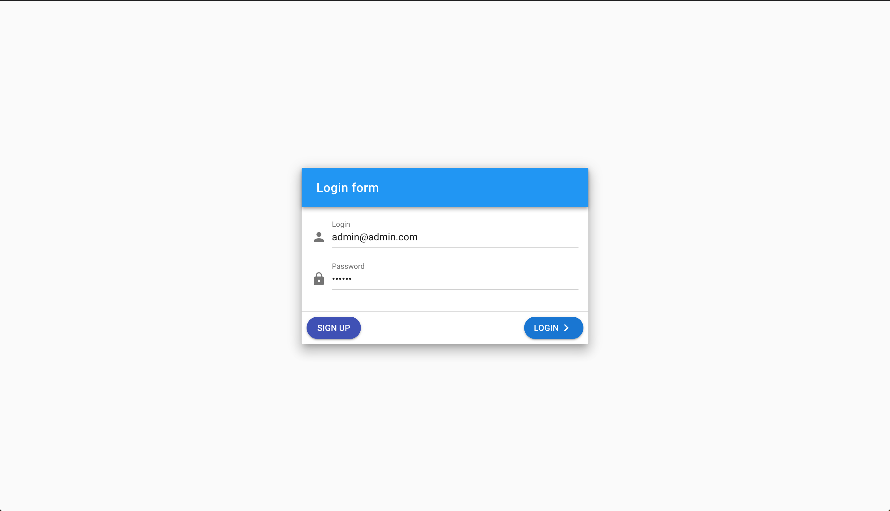
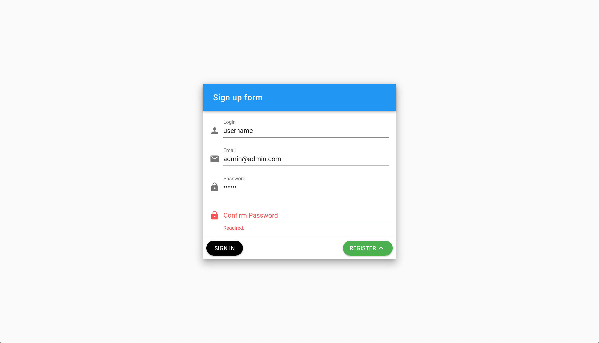
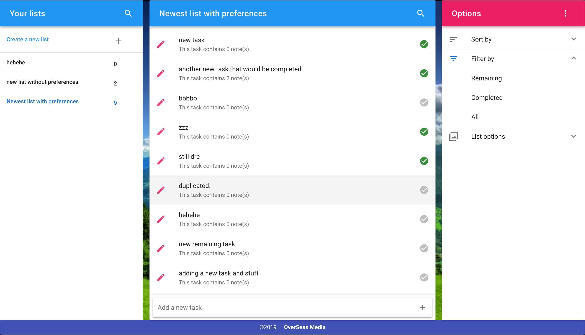
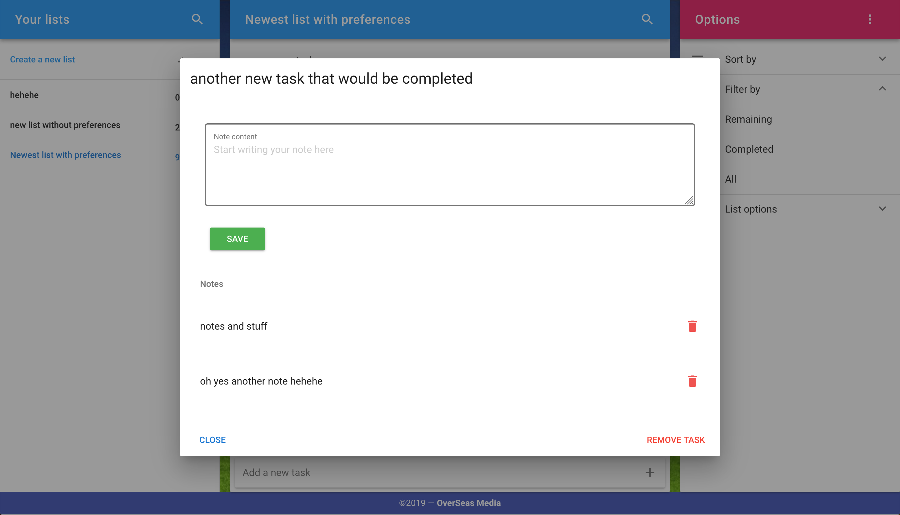

# Vue Todo Front-end 

This is the result of all the code that was written in the series of videos that i made, This is a [link](https://www.youtube.com/watch?v=ZpAQZ7HbweA&list=PLqhuffi3fiMNRoRU2dijolTTKOnE_197R) to the playlist and Unfortunately the repository is not separated into commits (every single does not equal a commit), this is the final repository for all the code that was written, only future videos will be added as commits.

## YouTube playlist

This [the link](https://www.youtube.com/watch?v=ZpAQZ7HbweA&list=PLqhuffi3fiMNRoRU2dijolTTKOnE_197R) to the playlist that contains all the videos (13 currently) and they cover various topics such as 
* Installing both Vue and Vuetify and using Material desing icons 
* Creating multiple UI's as separate file components 
* Installing vue-router and setting up some routes 
* Installing vuex and creating multiple modules and a store
* Use axios to fetch data from the API (that was made using symfony)
* Refresh expired JWT tokens by using axios interceptors 

## How to use this project?

First of all you have to either clone it to you disk or download the zip and the just cd into the project and run npm install to install the mode_nodules necessary for this to work

```
cd project_dir
npm install
npm run serve # run the dev server
```
__But wait, there's more__

This is just the fron-end, in order for this to work you need to have the back-end setup as well, this is [the link](https://github.com/konshensx16/symfony-todo-backend) to the repository take a look at it for futher infromation.

## Contributing

This project is open for everyone, if you notice anything wrong with my code, or even this readme, any mistakes are welcome.

## Questions

Maybe this should've been above with the Contribution section but doesn't matter, if you have any question i think it would be nice to create an issue (Please open an issue no matter how trivial you think the question is, no one will charge you money for it) that way people with similar questions can look them up.

## Screenshots

### Login page


### Sign-up page 


### Lists (First page you see after login in)
__ Notice how this list got a background :) __


### Tasks (after selecting a list)


### Notes (after clicking the edit icon on a task)
